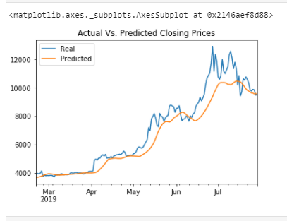

# deep-learning-homework
Unit 14 Deep Learning Homework

This assignment creates two models intended to predict the price of Bitcoin. The modeling employs the use of neural nets to try to create a faster prediction.

## I. Depenedencies

This assignment utilizes the following libraries:

* numpy as np
* pandas as pd
* hvplot.pandas
* from numpy.random import seed
    seed(1)
* from tensorflow import random
    random.set_seed(2)
* matplotlib inline%

## II. Summary of findings
After reviewing both models, the model utilizing closing prices more accurately predicted the nth closing price than the model utilizing the FNG index.

## Questions
> Which model has a lower loss?
> 
> * The closing model had a lower loss than the FNG model.
>
> Which model tracks the actual values better over time?
> 
> * The closing model tracked the actual values better over time. The FNG models had a much wider difference between the real and predicted prices in all variations of the model attempted, some as high as 700 dollars.
>
> Which window size works best for the model?
> 
> * Window Size 5 worked better in both models, creating the most accurate visualization in both models, but in the case of the closing model, there was the lowest difference of real and projected numbers than in any other attempt creating less than 200 dollars difference between actual and predicted prices with a loss percentage of approx 0.003. See the visualizations below for an idea.

### Model Visualizations
All visualizations of the closing model here were done with a batch of 20. FNG was done with a batch of 50. Other batches were tested in both cases, but I only provided visualizations for some. 

#### Closing Prices Modeling

##### 50 Epochs, 20 Batch

##### 65 Epochs, 20 Batch

##### 75 Epochs, 20 Batch

##### 75 Epochs, 20 Batch, Window 5

#### FNG Modeling

###### 75 Epochs, 50 Batch

##### 125 Epochs, 50 Batch

##### 375 Epochs, 50 Batch

##### 375 Epochs, 50 Batch

